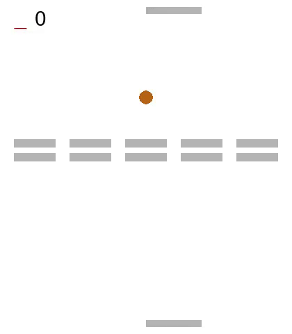

# Imitation Learning over Heterogeneous Agents with Restraining Bolts 

## Additional study case
In Reinforcement Learning, it is a common problem to find it challenging to model an accurate reward function that leads to a desired behavior of the agents. Inverse Reinforcement Learning aims to extract a reward function from a set of actions and observation provided by an expert agent, which can be another trained model, a model-based approach or even a human. Imitation Learning is the technique where a learner attempts from such expert's behavior. In this repository, a Restraining Bolt approach is explored, described in detail on the paper ["Imitation Learning over Heterogeneous Agents with Restraining Bolts."](https://www.dis.uniroma1.it/~degiacom/papers/2020/icaps2020dfip.pdf) (De Giacomo et all, 2020).

# The environment: Breakout-Pong

### Characteristics
* GOAL: Remove all the brick columns.
* There are as minumun 1 row and 3 columns of bricks
* Expert on the left. Uses *fire* as action to destroy the bricks.
* Learner on the right. Uses *bouncing ball* to dstroy the bricks.
* Add an additional paddle in top to respond the ball hits.

# Setup
Tested in Ubuntu 18.04.

## Set up environment
Set up virtual environment, and install additional dependencies. The repository includes a basic prepared environment, accessible through `pipenv`, which we encourage to use to handle the libraries.

* Clone this repository:

`git clone https://github.com/ArciAndres/ImitationLearningRestrainingBolts.git`  
`cd ImitationLearningRestrainingBolts`

* Create a virtual environment:
  
`pip install pipenv`  
`pipenv --python=python3.7`  
`pipenv install`

* Activate the virtual environment:

`pipenv shell`

# Credits

This code is strongly based in the repository from the reference paper:  
https://github.com/whitemech/Imitation-Learning-over-Heterogeneous-Agents-with-Restraining-Bolts

